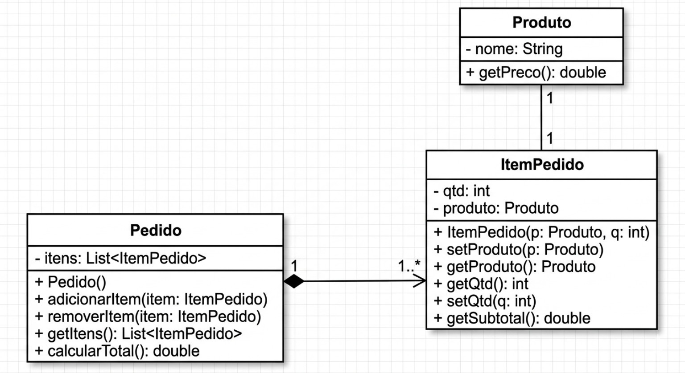

#  Sistema de Pedidos - Engenharia Reversa
 IVAMILTON  FERREIRA DA SILVA JÚNIOR
##  Sobre o Projeto

Este projeto consiste em um sistema de pedidos desenvolvido em HTML, CSS e JavaScript, com foco na aplicação de conceitos de Engenharia Reversa, Arquitetura de Software e Design de Software.

O sistema original apresentava problemas de organização e estrutura, que foram corrigidos através de refatoração e aplicação de padrões de projeto.

---

##  Objetivo da Atividade

- Analisar um sistema existente  
- Identificar problemas de design  
- Propor melhorias  
- Refatorar o código  
- Aplicar padrões de projeto (Factory e Singleton)  

---

## 🛠️ Melhorias Realizadas

- Refatoração com orientação a objetos  
- Criação das classes:
  - Produto  
  - ItemPedido  
  - Pedido  
- Centralização da lógica  
- Remoção de duplicação de código  
- Redução de acoplamento  

---

##  Padrões de Projeto

### Factory
Utilizado na criação de objetos Produto através da classe ProdutoFactory.

### Singleton
Utilizado na classe PedidoSingleton para garantir uma única instância do pedido.

---

## Diagrama UML

---

##  Documentação

[Baixar Relatório](trabalho_sistema_pedidos.docx)

---

##  Como Executar

1. Clone o repositório: