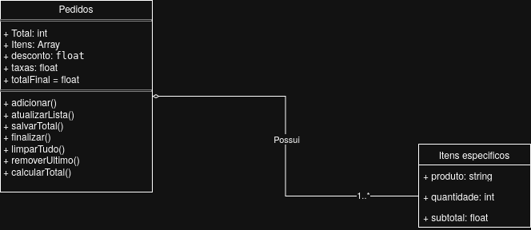

### Parte 1 – Compreensão do Sistema

**1.1 -** Trata-se de um sistema simples de pedidos para uma lanchonete, onde os clientes podem realizar pedidos, visualizar a lista de itens pedidos e consultar o valor final da conta.

**1.2 -** O sistema possui um painel simples contendo um *container* que armazena os itens disponíveis para escolha: Pastel, Caldo, Refrigerante e Suco. Há uma interface para selecionar a quantidade desejada de produtos, utilizando Números Racionais (para permitir quantidades não inteiras, se necessário). Por fim, existem dois botões: "Adicionar", que inclui o item e a quantidade à conta (mostrando os itens, quantidades e preços parciais), e "Finalizar Pedido", que exibe o valor total da conta.

**1.3 -** O usuário interage através da seleção dos itens disponíveis, do ajuste da quantidade desejada e dos botões para adicionar ao pedido ou finalizar a conta.

### Parte 2 – Identificação de Elementos

**2.1 - Funções aparentes ao usuário:**
* **Adicionar ao pedido (`adicionar()`):** Adiciona um item à lista de pedidos.
* **Atualizar a lista (`atualizarLista()`):** Atualiza a visualização da lista com os novos pedidos.
* **Finalizar pedido (`finalizar()`):** Encerra o pedido e exibe o preço total na tela.
* **Limpar pedido (`limparTudo()`):** Remove todos os itens da lista de pedidos.

**Funções redundantes ou não utilizadas:**
* **Salvar o preço total de pedidos (`salvarTotal()`):** Função redundante, pois a função `atualizarLista()` já executa essa tarefa.
* **Remover o último item da lista (`removerUltimo()`):** Embora programada no sistema, o software não a utiliza em momento algum.
* **Calcular o preço total dos pedidos (`calcularTotal()`):** Função redundante, pois a função `finalizar()` já realiza esse cálculo. Além disso, não está implementada corretamente no software, tornando-se "código morto".

**2.2 -** O *array* `itens` armazena objetos literais contendo: o nome do produto, a quantidade e o preço calculado em relação à quantidade. Há também a variável `total` para o preço final. Adicionalmente, existem dados sobre a taxa de serviço (5% do total) e regras de desconto: 10% se o valor total estiver entre R\$ 50,00 e R\$ 100,00, e 20% se for acima de R\$ 100,00.

**2.3 - Classes e Entidades:**
* **Classe Pedidos:** Armazena dados de desconto, preço total, taxas, total final (com taxas e descontos) e os itens inclusos.
* **Classe Itens Específicos:** Armazena o nome do produto, a quantidade e o preço.

### Parte 3 – Arquitetura

**3.1 -** Em minha análise, o sistema não possui uma estrutura definida. Existem códigos redundantes e não utilizados, as funções estão mal estruturadas e apresentam problemas de lógica aparentes. Isso demonstra falta de planejamento do código e a ausência de um padrão que otimize o sistema.

**3.2 -** Visivelmente, não há um padrão arquitetural. Não é Monolítica organizada, pois, apesar de ser um segmento único, é desorganizado. Não segue MVC, Arquitetura em Camadas ou Hexagonal, pois não há separação clara de responsabilidades. Também não se enquadra em SOA ou Microsserviços, já que o código é unificado.

**3.3 -** Julgando pelos elementos apresentados, acredito que este código seja fruto de improviso e pouco planejamento. Isso explica a desorganização, os erros e a falta de visão de projeto e arquitetura.

### Parte 4 – Modelagem

  

### Parte 5 – Análise de Problemas

* **Coesão:** O sistema apresenta baixa coesão. Muitas funções executam múltiplas tarefas, o que prejudica a manutenção. Elas deveriam ser mais específicas e diretas.
* **Acoplamento:** O acoplamento é alto. As funções são grandes e muito interdependentes, gerando um "efeito cascata": se uma parte falhar, afetará diversas outras partes do sistema.
* **Separação de responsabilidades:** Há pouca separação de responsabilidades e, quando existe, é feita de forma redundante, com trechos de código repetindo ações já realizadas por outras funções.
* **Duplicação de código:** O código possui funções duplicadas ou com propósitos idênticos, como `salvarTotal()` e `calcularTotal()`. Além disso, `calcularTotal()` não é utilizada, caracterizando "código morto".
* **Organização geral:** O código é desorganizado e mal planejado, dificultando a compreensão. Por ser um "código espaguete", causa problemas de lógica e manutenção, exigindo alterações em várias partes do sistema para corrigir um único *bug*.

### Parte 6 – Propostas de Melhoria

O código precisa passar por diversas melhorias. Primeiramente, é necessário refatorar as funções para torná-las mais específicas, visando aumentar a coesão e diminuir o acoplamento. Além disso, seria ideal aplicar um padrão arquitetural como Camadas, MVC ou Hexagonal para estruturar o projeto, melhorando a legibilidade e a organização. As variáveis devem ser renomeadas para nomes mais claros e coesos, também dever estar dentro de classes para que projeto possa ter uma fluidez melhor. Por fim, deve-se remover as aplicações redundantes e o "código morto" (funções não utilizadas).

### Parte 7 - Refatoração

Parte feita no código, foram feitas mudanças no script.js e index.html

### Parte 8 – Aplicação de Padões de Projeto

* **Factory:** -
Onde foi aplicado? Na classe `itemPedido()`. 

Por que ele foi utilizado? O padrão Factory foi escolhido para centralizar e padronizar a criação de objetos no sistema. Como a classe `itemPedido()` é instanciada com frequência e exige validações específicas, a Factory simplifica esse processo. Isso garante que o sistema possua um ponto único de acesso para montar esses objetos de forma consistente, eliminando a dependência de funções externas desnecessárias e reduzindo a complexidade no código cliente.

* **Singleton:** -
Onde foi aplicado? Na classe `Pedidos()`.

A classe `Pedidos()` gerencia uma das partes mais importante do sistema. O Singleton foi aplicado para evitar falhas como a existência de múltiplas instâncias na memória, problemas de sincronização, desperdício de recursos ou conflitos de dados. Esse padrão garante que exista apenas uma instância única e global da classe, protegendo a integridade das informações e permitindo um controle centralizado e seguro sobre o fluxo de pedidos.
