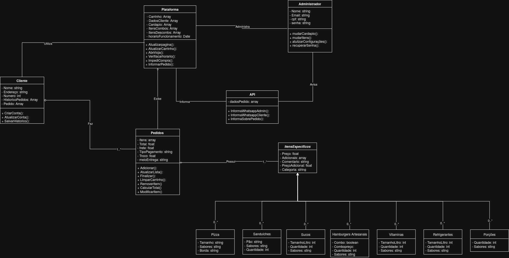

### Parte 6 – Modelagem do Sistema

#### As Classes

1 - `Plataforma`: É o núcleo do sistema e o contexto global da aplicação. Ela gerencia informações centrais, como o estado do carrinho, o cardápio, os dados dos clientes e o horário de funcionamento. É responsável pelas regras de negócio e ações de controle, como a abertura da loja e a validação de compras. Sua presença no diagrama é essencial, pois centraliza as automações e define os limites de interação do cliente.

2 - `Administrador`: Representa o gestor do sistema. Possui atributos de identificação pessoal e métodos com privilégios elevados, permitindo a gestão do cardápio e a alteração de configurações globais. O sistema inclui um Painel Administrativo protegido por autenticação, justificando a existência desta classe para gerenciar as entidades do domínio.

3 - `Cliente`: Representa o consumidor final e é um dos pilares do sistema, desenvolvido para otimizar a experiência de compra. Esta classe armazena dados essenciais para entrega e o histórico de pedidos. Além disso, permite que o usuário realize operações de cadastro (CRUD), como criar ou atualizar sua conta.

4 - `Pedidos`: Funciona como a representação do "Carrinho de Compras" e do fechamento da venda. Serve para agrupar as informações gerais das escolhas do cliente, tais como valor total, frete e método de pagamento. Suas responsabilidades incluem a manipulação de itens (adicionar/remover) e o cálculo do valor final do pedido.

5 - `ItensEspecificos`: É uma abstração que define o que pode ser incluído em um pedido. Caso o sistema utilize uma estrutura orientada a objetos, esta classe funciona como um molde, concentrando atributos comuns a todos os produtos da loja, como preço, adicionais, comentários e categoria.

6 - Subclasses: São as classes filhas de ItensEspecificos e representam os produtos reais do cardápio. Através do conceito de herança, elas herdam automaticamente os atributos da classe pai (como o preço), evitando redundância de código. Elas armazenam apenas o que é exclusivo de cada tipo, como: `Pizzas`, `Sanduíches`, `Sucos`, `Refrigerantes`, `Hambúrgueres` `Artesanais`, `Vitaminas` e `Porções`.

#### Os Relacionamentos

1 - **Associação Simples:**

1.1 - O Administrador administra a Plataforma: O Administrador possui um vínculo de controle direto sobre as funcionalidades da Plataforma.

1.2 - O Cliente utiliza a Plataforma: O Cliente acessa, navega e interage com os recursos disponibilizados pela Plataforma.

1.3 - A Plataforma exibe os Pedidos: A Plataforma é responsável por recuperar e apresentar as informações dos pedidos na interface para o usuário.

1.4 - A Plataforma informa a API: A Plataforma é informa a API do pedido do cliente para que ela possa mandar as informações do whatsapp.

1.5 - A API avisa o Administrador: O Administrador é avisado pela API sobre o pedido feito pelo Cliente.

2 - **Agregação:**

2.1 Cliente e Pedidos: O Cliente (Todo) possui uma coleção de Pedidos (Parte). Caso um pedido seja cancelado ou removido, o objeto Cliente permanece intacto no banco de dados.

2.2 Pedidos e ItensEspecificos: Um Pedido (Todo) é composto por Itens (Parte). Se o cliente esvaziar o carrinho ou desistir da compra, as definições dos produtos, exemplo hambúrgueres no cardápio, continuam existindo de forma independente no sistema.

3 - **Herança:**

3.1 - Superclasse e Subclasses: ItensEspecificos funciona como a Superclasse (classe pai). As classes que herdam seus atributos e métodos são as "filhas" (subclasses). Neste caso: Pizza, Sanduíches, Sucos, Refrigerantes, Hambúrgueres Artesanais, Vitaminas e Porções. Todas elas são tipos específicos de ItensEspecificos.

#### A Multiplicidade

1 - **1..* (Um ou Muitos):**

1.1 - Na linha de Cliente para Pedidos, que está ligada ao relacionamento "Faz", isso significa que um cliente ativo faz pelo menos 1 até infinitos ("`*`") pedidos ao longo do tempo.

1.2 - Na linha de Pedidos para ItensEspecificos, que está ligada ao relacionamento "Possui", isso significa que, para um Pedido ser válido e existir, ele não pode estar vazio. Ele precisa ter de 1 a vários (`*`) itens dentro dele.

2 - **0..* (Zero ou Muitos):**

Ela está Acima de todas as classes filhas, isso indica que, durante o funcionamento do sistema, podem existir desde nenhum (0) até incontáveis ("`*`") objetos desse tipo instanciados na memória. Por exemplo, podem existir 0 Sucos sendo pedidos, mas várias Pizzas.

#### Modelagem

  

